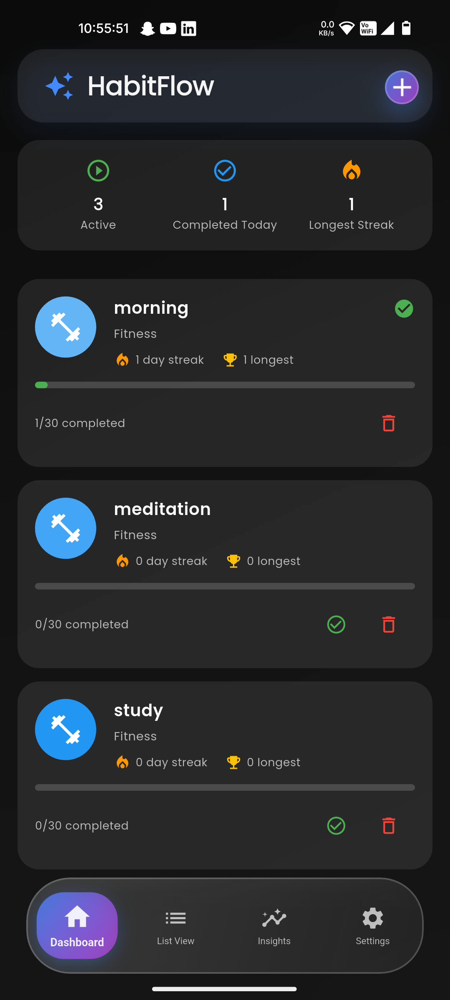
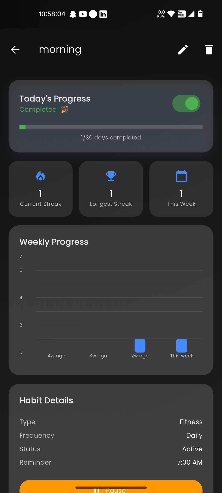
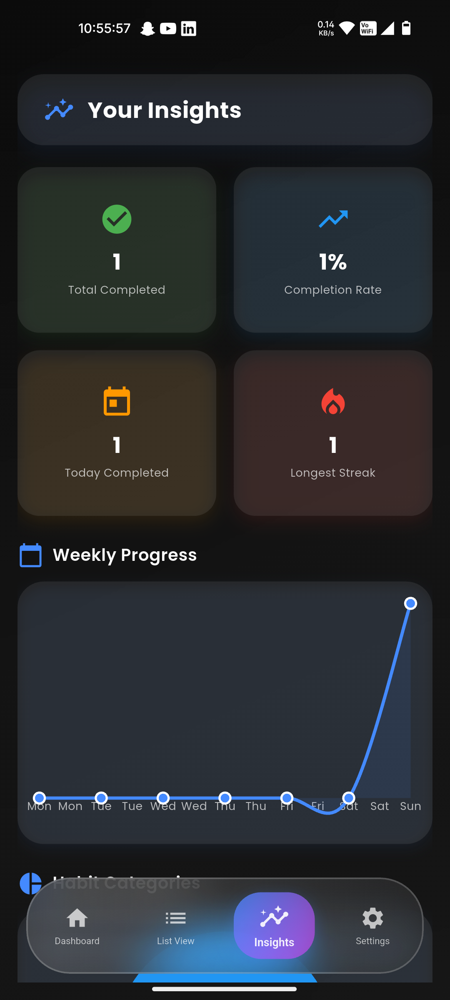
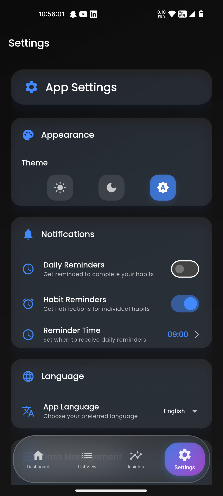

# 🌟 HabitFlow

[](https://flutter.dev/)
[](https://dart.dev/)
[](LICENSE)
[](https://flutter.dev/)
[](https://github.com/features/actions)

> **Transform your daily routines into lasting habits with HabitFlow** - A beautiful, intuitive habit tracking app built with Flutter that helps you build positive habits and break negative ones.

## ✨ Features

### 🎯 Core Functionality
- **Smart Habit Tracking** - Track daily, weekly, and custom habit frequencies
- **Beautiful Analytics** - Visual insights into your habit progress and streaks
- **Reminder System** - Never miss a habit with customizable notifications
- **Progress Visualization** - See your journey with beautiful charts and statistics
- **Data Export** - Backup and export your habit data

### 🎨 User Experience
- **Modern UI/UX** - Clean, intuitive interface with smooth animations
- **Dark/Light Theme** - Automatic theme switching based on system preferences
- **Responsive Design** - Works seamlessly across all devices
- **Splash Screen** - Beautiful animated introduction with glassmorphism effects
- **Gesture Support** - Intuitive swipe and tap interactions

### 🔧 Technical Features
- **Offline First** - Works without internet connection
- **Local Storage** - Secure data storage using Hive database
- **Cross-Platform** - Runs on Android, iOS, Web, and Desktop
- **Performance Optimized** - Smooth animations and fast loading times

## 📱 Screenshots

<div align="center">
  
  
  
  
</div>

*Screenshots coming soon - App is currently in development*

## 🚀 Getting Started

### Prerequisites

- [Flutter](https://flutter.dev/docs/get-started/install) (3.19.0 or higher)
- [Dart](https://dart.dev/get-dart) (3.3.0 or higher)
- [Android Studio](https://developer.android.com/studio) or [VS Code](https://code.visualstudio.com/)
- [Git](https://git-scm.com/)

### Installation

1. **Clone the repository**
   ```bash
   git clone https://github.com/yourusername/habitflow.git
   cd habitflow
   ```

2. **Install dependencies**
   ```bash
   flutter pub get
   ```

3. **Run the app**
   ```bash
   flutter run
   ```

### Building for Production

**Android APK:**
```bash
flutter build apk --release
```

**iOS:**
```bash
flutter build ios --release
```

**Web:**
```bash
flutter build web --release
```

## 🏗️ Project Structure

```
habitflow/
├── lib/
│   ├── main.dart                 # App entry point
│   ├── app.dart                  # Main app configuration
│   ├── models/                   # Data models
│   │   ├── habit.dart           # Habit model
│   │   └── habit_type.dart      # Habit type enums
│   ├── providers/               # State management
│   │   ├── habit_provider.dart  # Habit state management
│   │   └── settings_provider.dart # Settings state management
│   ├── screens/                 # UI screens
│   │   ├── dashboard_screen.dart
│   │   ├── habit_details_screen.dart
│   │   ├── insights_screen.dart
│   │   ├── list_view_screen.dart
│   │   ├── settings_screen.dart
│   │   ├── add_edit_habit_screen.dart
│   │   └── splash_screen.dart
│   ├── services/               # Business logic
│   │   ├── hive_service.dart   # Local storage
│   │   ├── notification_service.dart
│   │   ├── backup_service.dart
│   │   └── export_service.dart
│   └── widgets/                # Reusable UI components
│       ├── habit_card.dart
│       └── rive_animated_button.dart
├── assets/                     # App assets
├── test/                      # Unit and widget tests
└── pubspec.yaml              # Dependencies
```

## 🛠️ Technologies Used

- **[Flutter](https://flutter.dev/)** - Cross-platform UI framework
- **[Dart](https://dart.dev/)** - Programming language
- **[Provider](https://pub.dev/packages/provider)** - State management
- **[Hive](https://pub.dev/packages/hive)** - Local database
- **[flutter_local_notifications](https://pub.dev/packages/flutter_local_notifications)** - Push notifications
- **[timezone](https://pub.dev/packages/timezone)** - Timezone handling
- **[flutter_rive](https://pub.dev/packages/flutter_rive)** - Animations

## 📊 Key Features Breakdown

### Habit Management
- ✅ Create, edit, and delete habits
- ✅ Set custom frequencies (daily, weekly, custom)
- ✅ Track completion with beautiful animations
- ✅ View habit history and progress

### Analytics & Insights
- 📈 Visual progress charts
- 🔥 Streak tracking
- 📊 Weekly and monthly statistics
- 🎯 Goal achievement tracking

### Notifications
- 🔔 Customizable reminder times
- 📱 Push notifications for habit reminders
- ⏰ Smart notification scheduling
- 🔄 Missed habit notifications

### Data Management
- 💾 Local storage with Hive
- 📤 Export data functionality
- 🔄 Backup and restore
- 🗑️ Data cleanup options

## 🤝 Contributing

We welcome contributions! Please feel free to submit a Pull Request. For major changes, please open an issue first to discuss what you would like to change.

### Development Setup

1. Fork the repository
2. Create your feature branch (`git checkout -b feature/AmazingFeature`)
3. Commit your changes (`git commit -m 'Add some AmazingFeature'`)
4. Push to the branch (`git push origin feature/AmazingFeature`)
5. Open a Pull Request

### Code Style

- Follow the [Dart style guide](https://dart.dev/guides/language/effective-dart/style)
- Use meaningful variable and function names
- Add comments for complex logic
- Write tests for new features

## 🧪 Testing

Run the test suite:

```bash
# Run all tests
flutter test

# Run tests with coverage
flutter test --coverage

# Run specific test file
flutter test test/widget_test.dart
```

## 📦 CI/CD

This project uses GitHub Actions for continuous integration and deployment:

- **Tests** - Automated testing on every push
- **Build** - Cross-platform builds
- **Deploy** - Automatic deployment to stores
- **Security** - Dependency vulnerability scanning

## 📄 License

This project is licensed under the MIT License - see the [LICENSE](LICENSE) file for details.

## 🙏 Acknowledgments

- Flutter team for the amazing framework
- Hive team for the excellent local database
- All contributors and supporters
- The open-source community

## 📞 Support

If you have any questions or need help:

- 📧 Email: support@habitflow.app
- 🐛 Issues: [GitHub Issues](https://github.com/yourusername/habitflow/issues)
- 📖 Documentation: [Wiki](https://github.com/yourusername/habitflow/wiki)

## 🌟 Star History

[](https://star-history.com/#yourusername/habitflow&Date)

---

<div align="center">
  <p>Made with ❤️ by the HabitFlow Team</p>
  <p>If you find this project helpful, please give it a ⭐️!</p>
</div>
